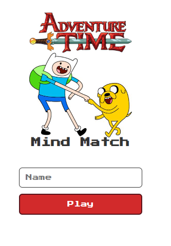

<h1 align="center"> 
    Mind-Match
</h1>
<p align="center">
  <a href="#-About">About</a>&nbsp;&nbsp;&nbsp;|&nbsp;&nbsp;&nbsp;
  <a href="#-Technologies">Technologies</a>&nbsp;&nbsp;&nbsp;|&nbsp;&nbsp;&nbsp;
  <a href="#-How to run">How to run</a>
</p>
<p align="center">
    
</p>

<h5 style="text-align: center"> Thank you for see !</h5>


## 📚 Sobre

Olá, tudo bem? O objetivo desse projeto da universidade é voltado para a saúde e/ou bem estar, foi usado como fonte de estudo os canais: **CodeCreative**, **Coding Hack**, **Online Tutorials** e **dcode** além de apostilas e PDF's da universidade. Através desse projeto aprendemos como trabalhar com os **_elementos_** no **HTML**, enquanto isso no **CSS** desenvolvemos toda parte de estilização do corpo do nosso **HTML**, adicionamos efeitos de escrever trabalhando com: **_@keyframes typing_** e piscar o cursor com: **_@keyframes blink-caret_**. Com o **JAVASCRIPT** a função **_typeLine_** simula a digitação de cada linha com atrasos específicos. Com o **JAVASCRIPT** gerenciamos a lógica do jogo, incluindo a criação e a revelação de cartas, checagem de vitórias e controle do temporizador. As cartas são representadas por pares de
imagens que são embaralhadas e exibidas para o jogador. Ao final do jogo, um alerta parabeliza o jogador e o direciona para diferentes rotas
dependendo do tempo que ele levou para concluir o jogo.

Para ter acesso a conteúdo similares, acesse: [CodeCreative](https://www.youtube.com/@CodeCreativeYT), [Coding Hack](https://www.youtube.com/@CodingHack), [Online Tutorials](https://www.youtube.com/@OnlineTutorialsYT) e [dcode](https://www.youtube.com/@dcode-software)

## 🧪 Tecnologias

Esse projeto foi desenvolvido com as seguintes tecnologias:

- [HTML](https://developer.mozilla.org/en-US/docs/Web/HTML)
- [CSS](https://developer.mozilla.org/en-US/docs/Web/CSS)
- [JavaScript](https://developer.mozilla.org/en-US/docs/Web/JavaScript)

## 🚀 Como executar

Clone o projeto e acesse a pasta do mesmo.

```bash
$ git clone https://github.com/arthursj/mind-match.git
$ cd mind-match
```

Para iniciá-lo, siga o passo abaixo:
```bash
# Inicie o projeto
$ npx lite-server
```
O app estará disponível no seu browser pelo endereço http://localhost:3000.

## 📚 About

Hello everything is fine? The objective of this university project is aimed at health and/or well-being, the channels were used as a source of study: **CodeCreative**, **Coding Hack**, **Online Tutorials** and **dcode**, in addition to university handouts and PDFs. Through this project we learned how to work with **_elements_** in **HTML**, meanwhile in **CSS** we developed the entire body styling part of our **HTML**, we added writing effects working with: **_@keyframes typing_** and blink the cursor with: **_@keyframes blink-caret_**. With **JAVASCRIPT** the **_typeLine_** function simulates the typing of each line with specific delays. With **JAVASCRIPT** we manage the game logic, including creating and revealing cards, checking victories and controlling the timer. Cards are represented by pairs of
images that are shuffled and displayed to the player. At the end of the game, an alert congratulates the player and directs him to different routes
depending on how long it took him to complete the game.

To access similar content, visit: [CodeCreative](https://www.youtube.com/@CodeCreativeYT), [Coding Hack](https://www.youtube.com/@CodingHack), [Online Tutorials](https://www.youtube.com/@OnlineTutorialsYT) and [dcode](https://www.youtube.com/@dcode-software)

## 🧪 Technologies

This project was developed with the following technologies:

- [HTML](https://developer.mozilla.org/en-US/docs/Web/HTML)
- [CSS](https://developer.mozilla.org/en-US/docs/Web/CSS)
- [JavaScript](https://developer.mozilla.org/en-US/docs/Web/JavaScript)

## 🚀 How to run

Clone the project and access its folder.

```bash
$ git clone https://github.com/arthursj/mind-match.git
$ cd mind-match
```

To start it, follow the step below:
```bash
# Start the project
$ npx lite-server
```
The app will be available in your browser at http://localhost:3000.

--------------

Developed by :atom_symbol: [**Arthur Silva**]([arthursj (ArthurSilva) (github.com)](https://github.com/arthursj))
